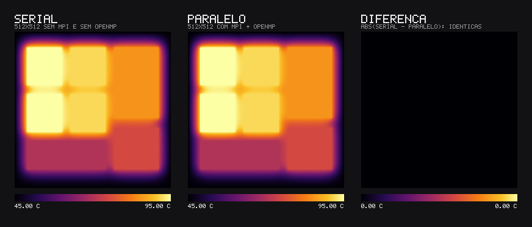
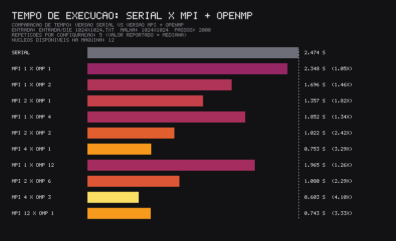

# Difusão de calor 2D com MPI + OpenMP

Trabalho de Introdução ao Processamento Paralelo e Distribuído - UFPel
Nicolas Cipriano & Rafael Mattia

## O problema

Simulamos a **difusão de calor no die de um processador**: uma malha 2D representa
a face de um chip de silício visto de cima. Blocos funcionais (núcleos, cache, iGPU)
ficam presos na sua temperatura de operação, a borda encosta no dissipador e fica a
45 °C, e a simulação calcula como o calor se espalha pelo resto do die ao longo do tempo.

O método é diferenças finitas explícitas (FTCS / Jacobi): a cada passo de tempo, a
temperatura de cada célula é atualizada a partir dela mesma e dos 4 vizinhos.

```
T_novo[i][j] = T[i][j] + r * (T[i+1][j] + T[i-1][j] + T[i][j+1] + T[i][j-1] - 4*T[i][j])
r = alfa * dt / dx²      (estável para r <= 0.25)
```

## De onde vêm as entradas

As entradas são **geradas pelo próprio projeto**, pelo programa
[src/gerar_entrada.cpp](src/gerar_entrada.cpp) — não usamos um banco de dados externo.
O gerador monta um *floorplan* (mapa de blocos) parametrizado de um processador quad-core
com iGPU e preenche a malha com:

- os **parâmetros físicos reais do silício**: condutividade `k = 148 W/(m·K)`,
  densidade `rho = 2329 kg/m³`, calor específico `cp = 700 J/(kg·K)`, que dão a
  difusividade térmica `alfa = k/(rho·cp) ≈ 9,08e-5 m²/s`;
- um die de 20 mm de lado, com `dx` e `dt` calculados para manter `r = 0,20`, dentro
  do limite de estabilidade do método;
- as temperaturas de operação de cada bloco (núcleos ~95 °C, cache ~70 °C, etc.) como
  condições de contorno fixas.

Ou seja, os números são sintéticos mas fisicamente coerentes. Para gerar uma malha:

```bash
./gerar_entrada 1024 1024 2000 entrada/die_1024x1024.txt   # nx ny passos arquivo
```

## Como o paralelismo é dividido

- **MPI** divide a malha em faixas horizontais de linhas, uma por processo. A cada
  passo, cada processo troca só as linhas de fronteira (*halo*) com os vizinhos, via
  `MPI_Sendrecv`.
- **OpenMP** paraleliza, dentro de cada processo, o laço que atualiza as células da
  faixa (`#pragma omp parallel for`).

```
arquivo → [rank 0 lê] → MPI_Scatterv → cada rank processa sua faixa (OpenMP)
                                          ↕ troca de halo (MPI_Sendrecv)
        → MPI_Gatherv → [rank 0 escreve arquivo]
```

**Disco não compartilhado:** como a máquina MPI não compartilha disco entre os nós,
**só o rank 0 abre arquivos**. Ele lê a malha, distribui as faixas com `MPI_Scatterv`,
recolhe o resultado com `MPI_Gatherv` e escreve a saída. Os outros processos recebem
tudo pela rede e nunca tocam o disco.

## Arquivos

| Arquivo | Descrição |
|---|---|
| [src/difusao_serial.cpp](src/difusao_serial.cpp) | Versão serial (sem MPI/OpenMP), referência de corretude. |
| [src/difusao_mpi_omp.cpp](src/difusao_mpi_omp.cpp) | Versão paralela MPI + OpenMP. |
| [src/gerar_entrada.cpp](src/gerar_entrada.cpp) | Gera o arquivo de entrada. |
| [scripts/comparar.py](scripts/comparar.py) | Confere se serial e paralelo dão o mesmo resultado. |
| [scripts/visualizar.py](scripts/visualizar.py) | Gera imagem PNG dos campos de temperatura. |
| [scripts/benchmark.sh](scripts/benchmark.sh) | Mede os tempos serial × paralelo. |

Os scripts usam só a biblioteca padrão do Python (sem matplotlib/numpy).

## Pré-requisitos

- Um compilador C++ com OpenMP (`g++`) e uma implementação de MPI (`mpicxx`/`mpirun`,
  ex.: Open MPI).
- **Python 3** (só para os scripts de validação, imagem e benchmark). Não precisa de
  nenhuma biblioteca extra, só o interpretador.

No Ubuntu/Debian:

```bash
sudo apt update
sudo apt install -y build-essential openmpi-bin libopenmpi-dev python3
```

No Fedora:

```bash
sudo dnf install -y gcc-c++ openmpi openmpi-devel python3
```

Para conferir se está tudo instalado:

```bash
g++ --version
mpirun --version
python3 --version
```

## Como compilar e rodar

```bash
make                    # compila os três programas

# serial
./difusao_serial entrada/die_256x256.txt saida/serial.txt

# paralelo: 4 processos MPI × 3 threads OpenMP
OMP_NUM_THREADS=3 mpirun -np 4 ./difusao_mpi_omp entrada/die_256x256.txt saida/paralelo.txt

# conferir que batem
python3 scripts/comparar.py saida/serial.txt saida/paralelo.txt
```

Atalhos: `make teste` (roda e valida), `make visual` (imagens), `make bench` (tempos).

## Validação

A versão paralela é validada contra a serial. O resultado é **idêntico bit a bit**
(diferença máxima `0.000e+00`), porque a divisão por linhas não muda a ordem das
operações.



## Resultados

Malha 1024 × 1024, 2000 passos, 12 núcleos. Cada configuração rodada 5 vezes (mediana).
Tempo serial: **2,98 s**.

| Processos MPI | Threads OpenMP | Tempo (s) | Speedup |
|---:|---:|---:|---:|
| 1 | 1  | 2,84 | 1,05× |
| 1 | 12 | 2,10 | 1,42× |
| 2 | 6  | 1,41 | 2,12× |
| 4 | 1  | **0,79** | **3,77×** |
| 12 | 1 | 0,90 | 3,32× |


